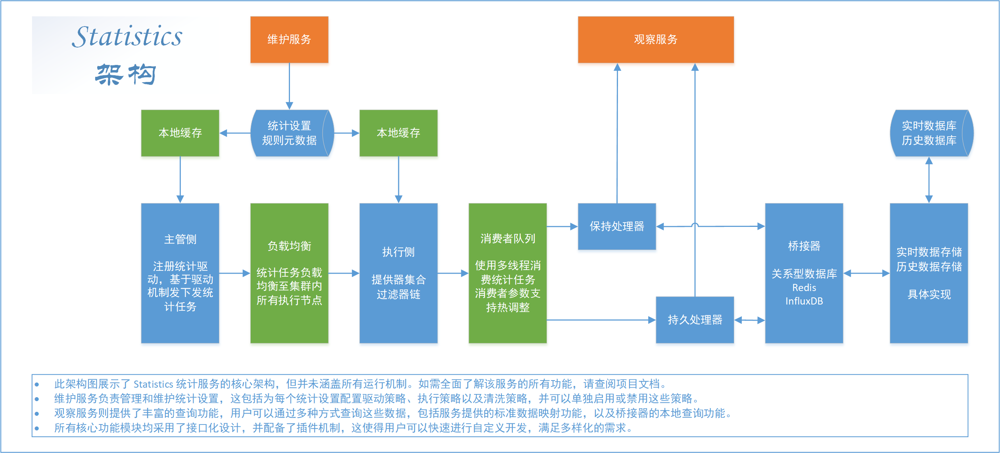

# Statistics Introduction - Statistics 简介

Statistics 是一款专注于数据统计的解决方案。

Statistics 基于统计服务的需求与特性，设计了针对性的功能方案。
在使用本服务时，您只需要关注统计算法本身，而不需要关注业务执行、数据存储、数据查询等问题。

您只需要通过插件开发的形式，将您的统计算法集成到本服务中，即可实现统计服务的功能。
当程序启动时，您的统计算法会被加载到服务中，并基于配置好的驱动策略，在满足特定条件时生产该统计算法的相关任务。
统计任务会被分发到不同的节点上执行，执行完成后，结果会被存储到数据存储中，您可以通过提供的查询接口查询统计结果。

---

## 国际化（I18N）

您正在阅读的文档是中文文档，您可以在 [wiki](../../wiki) 目录下找到其他语言的文档。

You are reading the Chinese document, you can find documents in other languages in the [wiki](../../wiki) directory.

- [简体中文](./Introduction.md)
- [English](../en_US/Introduction.md)

## 特性

- 基于统计服务的需求与特性，接口化设计了统计服务的功能方案，支持插件化开发。
- 提供统计业务全周期的功能接口，包括驱动机制、数据提供机制、数据过滤机制、桥接机制、数据映射机制等。
- 除数据提供机制为高度定制化外，其他机制均提供默认实现，您可以直接使用默认实现，也可以根据需求自定义实现。
- 分布式架构，可部署多个节点，可将统计任务分发到不同的节点上执行，实现负载均衡。
- 采用桥接器模式记录数据，支持多种数据存储方式，满足不同的数据存储需求。
- 提供系统事件，可通过第三方组件监听系统事件，实现更多的功能。
- 提供数据查询接口，可以直接通过提供的服务查询数据点的实时值和历史值。
- 提供数据映射查询接口，可以直接通过提供的服务对一段时间内的数据进行映射查询，包括开窗查看、占空比查询、高通查询、低通查询等。
- 提供基于 `telnet` 的运维平台，可以通过 `telnet` 连接到运维平台，设置关键参数，查看系统状态。
- 提供了统计任务的错误处理机制，可以处理统计过程中因错误导致的任务失败、任务过期、任务死亡等情况。

## 系统架构

Statistics 的系统架构如下图所示：

## 文档

该项目的文档位于 [docs](../../../docs) 目录下，包括：

### wiki

wiki 为项目的开发人员为本项目编写的详细文档，包含不同语言的版本，主要入口为：

1. [简介](./Introduction.md) - 镜像的 `README.md`，与本文件内容基本相同。
2. [目录](./Contents.md) - 文档目录。

## 运行截图

Telnet 运维平台指令合集：

在 Telnet 运维平台中查询主管状态：

在 Telnet 运维平台中对数据进行开窗查询：

